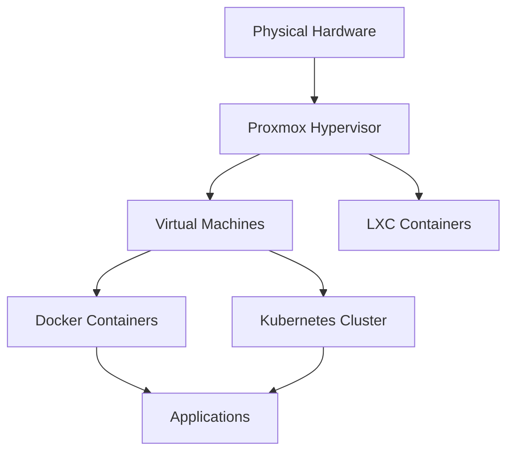

## Introduction

Welcome to the comprehensive homelab infrastructure documentation. This section covers everything you need to know about setting up and managing your homelab infrastructure, from virtualization to containerization.

<Callout title="New to Homelabs?">
  Start with our [Proxmox Setup](/docs/documentation/proxmox) guide to build your foundation, then progress through containerization with Docker and Kubernetes.
</Callout>

## Infrastructure Components

<Cards>

<Card icon={<Server className="text-blue-400" />} title="Proxmox" href="/docs/documentation/proxmox">
  Virtualization platform setup and management. The foundation of your homelab infrastructure.
</Card>

<Card icon={<Container className="text-purple-400" />} title="Docker" href="/docs/documentation/docker">
  Container orchestration and deployment. Lightweight application containerization.
</Card>

<Card icon={<Layers className="text-green-400" />} title="Kubernetes" href="/docs/documentation/kubernetes">
  Container orchestration at scale. Advanced container management and deployment.
</Card>

<Card icon={<HardDrive className="text-orange-400" />} title="VMs & LXC" href="/docs/documentation/vms-lxc">
  Virtual machines and Linux containers. Traditional and lightweight virtualization.
</Card>

</Cards>

## Quick Start Guide

<Accordions>

<Accordion id="beginner" title="🚀 I'm new to homelabs">

**Recommended Learning Path:**

1. **Start with Proxmox** - Set up your virtualization platform
2. **Create your first VM** - Learn basic virtual machine management  
3. **Try LXC containers** - Explore lightweight containerization
4. **Move to Docker** - Modern application containerization
5. **Scale with Kubernetes** - Advanced orchestration (optional)

**Time Investment:** 2-4 weeks for basics, 2-3 months for proficiency

</Accordion>

<Accordion id="intermediate" title="⚡ I have some experience">

**Focus Areas:**

- **Infrastructure as Code** - Automate your deployments
- **Monitoring & Logging** - Implement observability
- **Backup Strategies** - Protect your data
- **Security Hardening** - Secure your environment

**Advanced Topics:** High availability, disaster recovery, performance optimization

</Accordion>

<Accordion id="advanced" title="🔥 I want production-ready setup">

**Enterprise Features:**

- **Clustering** - Multi-node setups for high availability
- **Load Balancing** - Distribute traffic efficiently  
- **CI/CD Integration** - Automated deployment pipelines
- **Compliance** - Security and audit requirements

**Professional Skills:** DevOps practices, SRE principles, cloud-native architectures

</Accordion>

</Accordions>

## Architecture Overview

Your homelab infrastructure follows a layered approach:

### Infrastructure Layers

1. **Hardware Layer** - Physical servers, networking, storage
2. **Hypervisor Layer** - Proxmox for virtualization management
3. **Compute Layer** - VMs and LXC containers for workload isolation
4. **Container Layer** - Docker and Kubernetes for application deployment
5. **Application Layer** - Your services and applications

## Best Practices

<Callout type="warn" title="Important Considerations">
  Always implement proper backup strategies before deploying production workloads. Test your disaster recovery procedures regularly.
</Callout>

### Security First

- **Network Segmentation** - Isolate different service tiers
- **Access Control** - Implement proper authentication and authorization
- **Regular Updates** - Keep all systems patched and updated
- **Monitoring** - Implement comprehensive logging and alerting

### Performance Optimization

- **Resource Planning** - Right-size your VMs and containers
- **Storage Strategy** - Use appropriate storage types for workloads
- **Network Design** - Optimize network topology for your use case
- **Monitoring** - Track performance metrics and optimize accordingly

## What's Next?

Ready to start building? Choose your path:

<Cards>
  <Card title="🏗️ Build Foundation" href="/docs/documentation/proxmox" description="Set up Proxmox virtualization platform" />
  <Card title="🐳 Learn Containers" href="/docs/documentation/docker" description="Master Docker containerization" />
  <Card title="☸️ Scale with K8s" href="/docs/documentation/kubernetes" description="Deploy Kubernetes clusters" />
  <Card title="🛠️ Manage VMs" href="/docs/documentation/vms-lxc" description="Virtual machine best practices" />
</Cards>