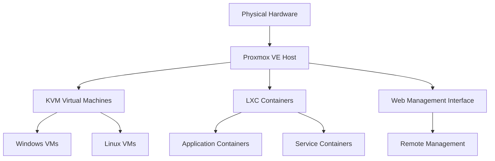

## Introduction

Proxmox Virtual Environment (VE) is a powerful, open-source platform for enterprise virtualization that combines KVM hypervisor and LXC containers with a web-based management interface. This comprehensive guide covers everything from initial installation to advanced clustering and security hardening.

<Callout title="What is Proxmox VE?">
  Proxmox VE is a complete virtualization management solution that provides enterprise-class features like high availability, live migration, storage replication, and integrated backup solutions.
</Callout>

## Key Features

<Cards>

<Card icon={<Server className="text-blue-400" />} title="KVM Virtualization">
  Full virtualization with KVM hypervisor for running any operating system with near-native performance.
</Card>

<Card icon={<Container className="text-green-400" />} title="LXC Containers">
  Lightweight Linux containers for efficient resource utilization and rapid deployment.
</Card>

<Card icon={<Globe className="text-purple-400" />} title="Web Management">
  Intuitive web-based interface for managing your entire virtualization infrastructure.
</Card>

<Card icon={<Shield className="text-orange-400" />} title="High Availability">
  Built-in clustering and HA features for enterprise-grade reliability and uptime.
</Card>

</Cards>

## Getting Started

<Accordions>

<Accordion id="beginner" title="🚀 New to Proxmox">

**Recommended Learning Path:**

1. **[Installation](/docs/documentation/proxmox/installation)** - Set up Proxmox VE on your hardware
2. **[Post-Install Setup](/docs/documentation/proxmox/post-install)** - Essential configuration and optimization
3. **[Network Configuration](/docs/documentation/proxmox/network-config)** - Configure networking and bridges
4. **[Storage Management](/docs/documentation/proxmox/storage-management)** - Set up storage pools and types

**Time Investment:** 1-2 days for basic setup, 1-2 weeks for proficiency

</Accordion>

<Accordion id="intermediate" title="⚡ Ready for Production">

**Advanced Configuration:**

- **[VM Management](/docs/documentation/proxmox/vm-management)** - Create and manage virtual machines
- **[Container Management](/docs/documentation/proxmox/container-management)** - Deploy and manage LXC containers
- **[Backup Strategies](/docs/documentation/proxmox/backup-strategies)** - Implement comprehensive backup solutions
- **[Security Hardening](/docs/documentation/proxmox/security-hardening)** - Secure your Proxmox environment

**Enterprise Features:** Clustering, high availability, live migration

</Accordion>

<Accordion id="advanced" title="🔥 Enterprise Deployment">

**Production-Ready Features:**

- **[Clustering & HA](/docs/documentation/proxmox/clustering-ha)** - Multi-node clusters with high availability
- **[Essential Tools](/docs/documentation/proxmox/essential-tools)** - Automation and management tools
- **[Best Practices](/docs/documentation/proxmox/best-practices)** - Performance optimization and maintenance

**Professional Skills:** Disaster recovery, performance tuning, automation

</Accordion>

</Accordions>

## System Requirements

### Minimum Requirements
- **CPU:** 64-bit processor with virtualization support (Intel VT-x or AMD-V)
- **RAM:** 2GB (8GB+ recommended for production)
- **Storage:** 32GB (SSD recommended)
- **Network:** Gigabit Ethernet adapter

### Recommended Production Setup
- **CPU:** Multi-core processor with 8+ cores
- **RAM:** 32GB+ ECC memory
- **Storage:** Multiple drives for redundancy (RAID configuration)
- **Network:** Multiple NICs for redundancy and performance

## Architecture Overview

Proxmox VE provides a complete virtualization stack:

### Core Components

1. **Hypervisor Layer** - KVM for full virtualization, LXC for containers
2. **Management Layer** - Web interface, API, and command-line tools
3. **Storage Layer** - Local and shared storage with advanced features
4. **Network Layer** - Software-defined networking with VLANs and bridges
5. **Cluster Layer** - Multi-node clustering and high availability

## Quick Start Guide

<Cards>

<Card title="📦 Installation" href="/docs/documentation/proxmox/installation">
  Download, install, and perform initial setup of Proxmox VE on your hardware.
</Card>

<Card title="⚙️ Post-Install" href="/docs/documentation/proxmox/post-install">
  Essential post-installation configuration, updates, and optimization.
</Card>

<Card title="🌐 Network Setup" href="/docs/documentation/proxmox/network-config">
  Configure networking, bridges, VLANs, and network security.
</Card>

<Card title="💾 Storage Config" href="/docs/documentation/proxmox/storage-management">
  Set up local and shared storage with ZFS, LVM, and network storage.
</Card>

</Cards>

## Documentation Sections

### 🏗️ Foundation
- **[Installation Guide](/docs/documentation/proxmox/installation)** - Complete installation process
- **[Post-Install Setup](/docs/documentation/proxmox/post-install)** - Essential configuration steps

### ⚙️ Configuration  
- **[Network Configuration](/docs/documentation/proxmox/network-config)** - Networking and bridges
- **[Storage Management](/docs/documentation/proxmox/storage-management)** - Storage pools and types

### 🖥️ Virtualization
- **[VM Management](/docs/documentation/proxmox/vm-management)** - Virtual machine operations
- **[Container Management](/docs/documentation/proxmox/container-management)** - LXC container management

### 🚀 Advanced Topics
- **[Backup Strategies](/docs/documentation/proxmox/backup-strategies)** - Comprehensive backup solutions
- **[Clustering & HA](/docs/documentation/proxmox/clustering-ha)** - High availability setup
- **[Security Hardening](/docs/documentation/proxmox/security-hardening)** - Security best practices

### 🛠️ Tools & Optimization
- **[Essential Tools](/docs/documentation/proxmox/essential-tools)** - Automation and helper tools
- **[Best Practices](/docs/documentation/proxmox/best-practices)** - Performance and maintenance

## Community Resources

<Callout type="info" title="Getting Help">
  The Proxmox community is active and helpful. Check the official forums, documentation, and community scripts for additional resources and troubleshooting.
</Callout>

### Useful Links
- **Official Documentation** - [pve.proxmox.com](https://pve.proxmox.com/pve-docs/)
- **Community Forum** - [forum.proxmox.com](https://forum.proxmox.com/)
- **Helper Scripts** - [tteck/Proxmox](https://github.com/tteck/Proxmox)
- **Wiki** - [pve.proxmox.com/wiki](https://pve.proxmox.com/wiki/)

## What's Next?

Ready to start your Proxmox journey? Choose your path:

<Cards>
  <Card title="🆕 First Time Setup" href="/docs/documentation/proxmox/installation" description="Complete installation and initial configuration" />
  <Card title="🔧 Configuration" href="/docs/documentation/proxmox/network-config" description="Network and storage configuration" />
  <Card title="🖥️ Create VMs" href="/docs/documentation/proxmox/vm-management" description="Virtual machine management" />
  <Card title="📦 Containers" href="/docs/documentation/proxmox/container-management" description="LXC container deployment" />
</Cards>